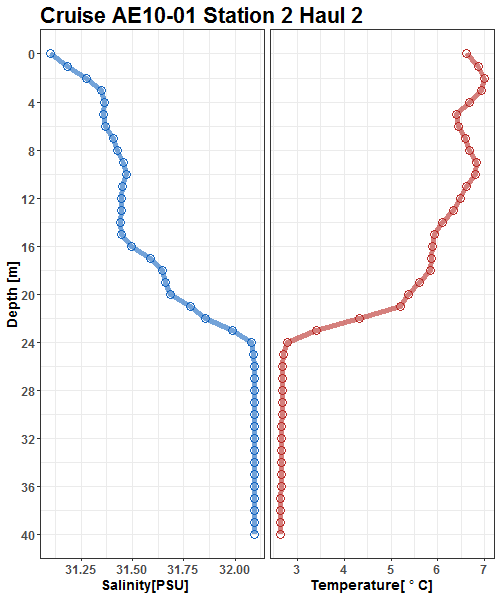
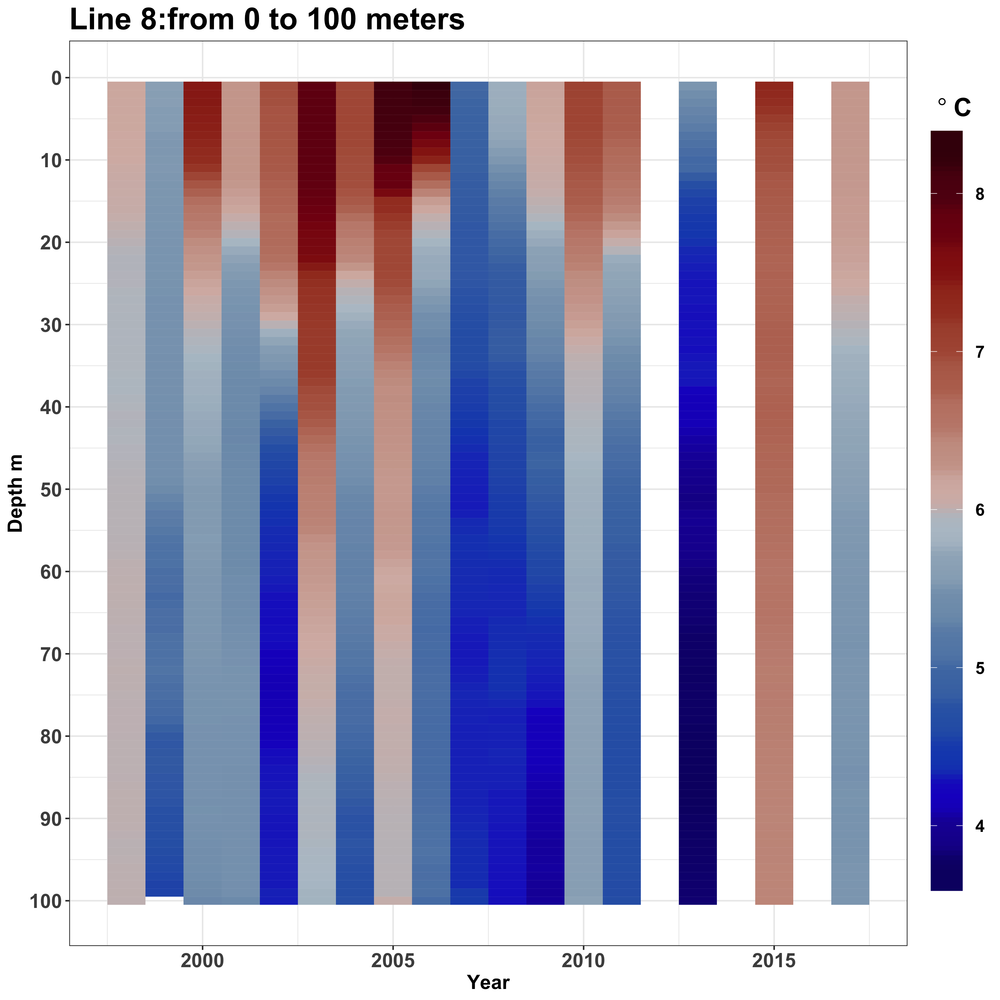
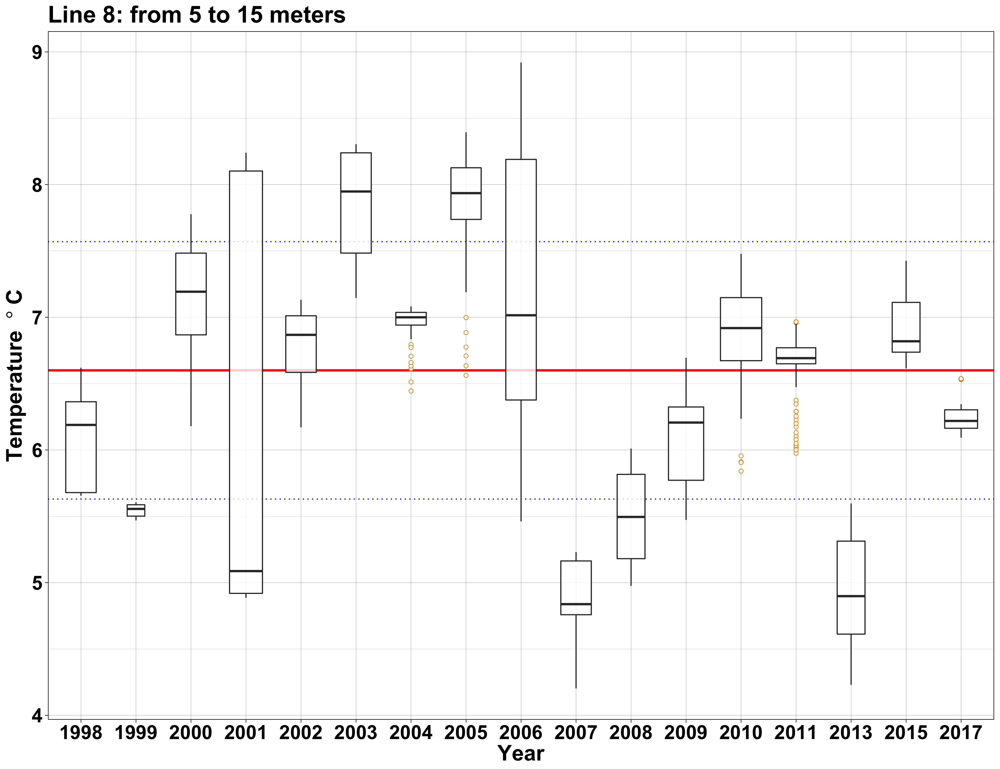

```{r setup, include = FALSE}
knitr::opts_chunk$set(
  collapse = TRUE,
  comment = "#>"
)
```

```{r, echo=FALSE}
htmltools::img(src = knitr::image_uri("hex_sticker_color.png"), 
               alt = 'logo', 
               style = 'position:absolute; top:0; right:0; padding:10px;')
```

**Abstract**
The `FastrCAT` package makes it easy to use temperature and salinity data collected by a SeaBrid FastCAT. The package provides functions to read in .up files and bind them into a single dataframe, provide QA/QC feedback, plot depth by temperature/salinity for each cast, and maps of sample intensity, temperature, and salinity. 

# Installation of the FastrCAT package from GitHub

```{r, echo=TRUE, message=FALSE, warning=FALSE, eval= FALSE}
install.packages(remotes)

remotes::install_github("Copepoda/FastrCAT/FastrCAT", build = TRUE, 
                        build_opts = c("--no-resave-data", "--no-manual"))
```

# Introduction
Oceanographic data generated from SeaBird FastCAT CTD’s have been collected since 1995 under EcoFOCI. The file type which we can view and collate the data from is a SeaBird proprietary file type called an .up file. The .up file is a post process file generated from the SeaSoft software and only includes the data from the upward cast of the device. Since 1997 there have been various versions of a Perl script which will append important station header information to the .up file. The Perl script acts as an interface between the SeaSoft software and the MasterCOD .db3 file to extract the header information based on the BON/CALVET/TUCK number. Each station from a cruise has its’ own .up file. This format isn’t in a traditional tabular format and is not easily accessed by users. It has been determined that it would be useful to build an R package for the FastCAT data that starts with a function to aggregate each cruises .up files into a tabular format. The function can then be used to generate tabular data and as a QAQC process for the .up files. Then the tabular data be easily used to create plots and calculate indices.  This R package would be a final step in processing .up files while out at sea. The steps would be: enter COD form data into MasterCOD, run Perl script and then the R functions from the command line. 


```{r, echo=TRUE, message=FALSE, warning=FALSE, eval = FALSE}
library(FastrCAT)
```

Functions in FastrCAT
---
  `make_dataframe_fc()`

  `plot_ts_fc()`
  
  `map_fc()`
  
  `fill_missing_stations()`
  
  `to_ecodaat()`
  
  `plot_time_series()`
  
  `boxplot_time_series()`
  

make_dataframe_fc()
---	
This function writes a single data frame in .csv format to file containing oceanographic data collected by the FastCat during a cruise.  The format and column naming conventions are specific to the needs of EcoDAAT. This is the primary function of the FastrCAT package and must be run prior to all other functions. All other functions depend on the data frame generated. A cruise summary report is generated and written to file. The cruise summary is in .html format. The summary contains basic information about the data and some summary statistics. Plots of the average temperature and salinity profiles and a station map. It also provides feedback on which .up files might be problematic due to header information or anomolous temperature and salinity readings. 

**Usage**

```{r,eval=FALSE}
 make_dataframe_fc(current_path = "path/ to directory/ of .up files",
                   GE = FALSE,
                   Cruise_report = TRUE,
                   DF = TRUE)
```

Shows the first four rows and the first seven columns of an example dataframe. 
```{r, echo = FALSE}
example_file <- read.csv("DY15-05_forEcoDAAT.csv")
head(example_file[,c(1:7)],4)
```

All the column names:

```{r, echo = FALSE}
colnames(example_file)
```

**MasterCOD Acquired Information**

All header information is hand entered into MasterCOD from a COD form for each consecutive FastCAT deployment. Header information acquired by the PERL script has not been consistent across all years. Since 1997 theses have been the various headers acquired from MasterCOD: latitude, longitude, date, time, cruise name, station name, haul name, Foci grid name, bottom depth, and instrument type. The function as built handles all types of header information listed above. Latitude and longitude are converted from degrees minutes seconds to decimal degrees. Date and time are converted into a date-time format set with a UTC time zone. One common error is that no header information is found. This error is most commonly due to the FastCat data being processed prior to station information being entered into MasterCOD. The function FastCat_compile.R within the package FastrCAT will generate a warning which is in the Cruise Report. 
	

**Example Header Warning in Cruise Report**

>"1" "This file G:/SeaCatData/Processed/1DY10/CAL001.up has no header info needs to be reprocessed."


This warning is telling the user that all header information is missing and that it needs to be reprocessed after the information has been entered into MasterCOD. Once this has been done the function make_dataframe_fc() can be run again. Human errors that are common are handled with exceptions within the function. When a user does not enter a field into MasterCOD the named header line is blank. The function will enter an NA.


**Example Header line in .up file:**

>@ Cruise: DY12-05 (“DY12-05”  in the dateframe)
>
@ Cruise:"  " (NA  in the dataframe)


Another error is when the Foci-grid designation or the BON number is entered into the station_name. The function will find this type of error and place the Foci_grid name into the correct column and leave the Station name blank. In other cases the Station name has been station.haul. The function will check to see if this is the case and separate the two and place station in station and haul in haul. When one of these three are missing it will require some corrections. The solution at sea would be to make sure that all these fields are entered into MasterCOD and then re-run the function. For older files this would require generating a table from EcoDAAT of Cruise, Haul, and FOCi_Grid to look-up and replace all missing values.  
Issues that can’t be resolved by the make_dataframe_fc() are when Cruise names or Foci_grid names are misspelled, which can be an issue when filtering or manipulating the resulting data. These issues would need to be QAQC’s after the fact and corrected. Sometimes, time, which is entered into MasterCOD as a four digit string is a nonsense time such as 0860. When this is the case, the function tries to convert it into a date-time object and cannot which results in an NA. Date can also be entered in incorrectly, if the format is correct the conversion to a date-time object will be fine, but the date might be incorrect. This would have to be QAQC’d after the data has been compiled by the function. 


**Seasoft Binned Data**

In each .up file the numerical data is found in tab delineated columnar format after \*END*. Each row in the .up file represents a single integer of pressure. The SeaBird FastCAT takes readings 16 times a second. For all values within an integer of pressure, one can select an average or an interpolated average. Over the years there have been as few as four columns of data up to nine. First the function looks to see if there is any data. If there is no data then a warning will be in the Cruise Report. 


**No data warning example from Cruise Report:**
	
>1" "This file G:/SeaCatData/Processed/DY17-05/BON055.up has no data associated with it."

When this occurs then header information is still gathered so there is a record of it but it will have blanks for all the numerical data columns. The function can handle the inconsistent column amounts. It looks for the name of each column and renames it in a standard format so that all data generated can be easily bound together. The data columns selected were pressure, temperature, conductivity, salinity, sigma_T, and flag. When there are more than these they will be dropped from the dataframe. Depth is added as a calculated value from pressure. The calculation is based on the AN69: Conversion of Pressure to Depth documented on the SeaBird website. This conversion requires latitude, so if latitude is missing depth will be an NA. Finally there are sometimes bad spikes in the data, a common cause being a bad termination. There is a filter in the function to remove temperatures less than -3 and greater than 20. As well as salinity values less than 0.05 and greater than 38. 


**Cruise Summary .html**

Provides a short paragraph of number of tows, salinity, temperature, and location information. Summary statistics: minimum, median, mean, max, and number of NA’s are also provided. This provides the user a paragraph ready for a cruise report and can be used as a quick data check.  There is a plot of the average temperature salinity plot profile with 95% confidence intervals. A station map. And QA/QC information about missing header data, no data files, and files which contained outlier salinity and temperature data which was filtered out. If data seems incorrect then it is advised that values be corrected in MasterCOD and then to re-run the perl script and make_dataframe_fc(). Then a new summary will be generated. 

**Example of Cruise Summary**

```{r, echo = FALSE, results = 'asis'}
knitr::asis_output(htmltools::includeHTML("DY15-05_Cruise_Report.html"))
```


plot_ts_fc()
---
Once make_dataframe_fc() has been run, then plot_ts_fc() can be used. This function creates a depth by salinity and temperature plot for each station. 
	
```{r,eval=FALSE}
 plot_ts_fc("path/ to directory/ of fastrcat dataframe")
```	

These are all .png files which will be located in the plot folder within the current folder. It only needs to be run once to generate a plot for each station. Each dot is a data point.  Check the profile for each station/haul. 
	
```{r echo=FALSE, fig.cap= "Correct Output", fig.show='hold'}



```

For instance in the second plot below, it seems that two tows had the same Station and haul designation. If this occurs check the COD forms and MasterCOD and correct. This occurred because Station ID was station.haul and haul was not a value grabbed from MasterCOD. This allowed two consecutive casts to have the same station.haul information, where the second should have been Station 41, haul 3. 

```{r echo=FALSE, fig.cap= "Incorrect Output", fig.show='hold'}

knitr::include_graphics("AE10-01_Station_41_2.png")

```


map_fc()
---

Once the make_dataframe_fc() has been run and the .csv file of the temperature, salinity, and conductivity is available you can use map_fc(). This function makes a station map by default. Other choices are sampling intensity, Salinity, and Temperature. The Salinity and Temperature maps are interpolated using inverse distance weighting and depth ranges can be selected as well. 

```{r,eval=FALSE}
 map_fc(current_path = "path/ to directory/ of fastrcat dataframe",
        map_type = "Sample Intensity",
        depth_range = NA)
```	

Here is an example of a sampling intensity map. Scales for legend will always be the same, for easy comparison among years. 

```{r echo=FALSE, fig.cap= "Sample Intensity Map", fig.show='hold'}

knitr::include_graphics("DY1705_SampleIntensity.png")

```

Here is an example of a temperature map. This map shows the average temperature from 5 to 10 meters across the sampling grid. 

```{r, eval = FALSE}
map_fc(current_path = "path/ to directory/ of fastrcat dataframe",
       map_type = "Temperature",
       depth_range = c(5,10))
```

```{r echo=FALSE, fig.cap= "Temperature Map", fig.show='hold'}

knitr::include_graphics("DY15-05_Temperature_5_10.png")

```

The following functions should be done once you have access to EcoDAAT with the corrected haul data and to past years data.


fill_missing_stations()
---

Like the name implies, this function will fill in the missing station name, foci grid name, and haul number in the dataframe which is generated by make_dataframe_fc(). This is a function which is used in conjuction with a dataframe in .csv format of haul records queried from EcoDAAT. This requires that the cruise haul information associated with the .up files has been uploaded into EcoDAAT. This function assits in data completness after a cruise has been completed. 

**Usage**
```{r, eval= FALSE}
fill_missing_stations(path_fc = "path/ to fastrcat/dataframes",
                      path_haul_records = "path/ to haul/ records")

```

to_ecodaat()
---
This function preps data for easy loading into EcoDAAT. You provide it with a path to the folder with all the cruise seasons files prepared using the make_dataframe_fc() function. It will rename and bind together all files so only one file needs to be loaded into EcoDAAT per year. It is recommended that all QA/QC check have been done before and that the function fill_missing_stations() has been run to correct for missing haul information. 

**Usage**
```{r, eval= FALSE}
to_ecodaat(fc_data_path = 
             "path/ to directory/of current years fastcat/ dataframes")

```

plot_time_series()
---
Use this function when you have historical and the current years data available. The function creates either temperature or salinity plots of core EcoFOCI stations in the Gulf of Alaska. Each plot displays the average temperature or salinity for each meter of depth of the core stations for each year for the months when peak sampling of these regions occured. Line 8 and Semidi area are most commonly sampled in May and June, which is considered Spring. Summer sampling in the Gulf of Alaska has been less frequent and starts in the early 2000's. This summer sampling is in the Semidi core area, summer is considered August and September.Post 2010, these core stations were only sampled in odd numbered years. In the future more core areas will be added. 
You can add a new cruises data to the historical data by providing the path of the new fastcat data to the fastcat_data parameter. The default is set to FALSE, so you only need to provide the historical data set. You can also set the minimum and maximum depth to display on the plots. These have a default of a minimum depth of 0 meters and a maximum depth of 100 meters.

**Usage**
```{r, eval= FALSE}
plot_time_series(hist_data = "path/ to directory/of historical .csv",
                 core_stations = "Line 8",
                 plot_type = "temperature",
                 min_depth = 0,
                 max_depth = 100, 
                 fastcat_data = FALSE)
```

```{r echo=FALSE, fig.cap= "Line 8 Historical Data", fig.show='hold'}



```


boxplot_time_series()
---
This takes the same paramters as plot_time_series(), it produces a boxplot of plot_type by year. It displays the historical median and its' standaerd deviation.  

**Usage**
```{r, eval= FALSE}
boxplot_time_series(hist_data = "path/ to directory/of historical .csv",
                 core_stations = "Line 8",
                 plot_type = "temperature",
                 min_depth = 5,
                 max_depth = 15, 
                 fastcat_data = FALSE)
```

```{r echo=FALSE, fig.cap= "Line 8 Historical Data", fig.show='hold'}



```


Using FastrCAT at Sea
---
Since people are already familiar with using the command line to run the Perl script out at sea it seemed logical to have people do the same for the R package functions. 
Requirements for running the package out at sea. These instructions are specific to the 
at-sea computers which are running Windows operating systems. 

1.The most current version of R, R (32-bit) version 3.5.1 – “Feather Spray” must be installed on the at sea laptops.

2.All libraries and packages required to run functions must be installed. 
“list of dependencies”

3.The FastrCAT package


Example of Using FastrCAT in the command line:


**1.	Change directory to where the R program files are.**

> C:\>  cd C:/”Program Files”/R/R-3.5.1/bin

**2.	Start an R session.**

> C:\Program Files\R\R-3.5.1\bin>  R
>
>*You will see a bunch info about R pop up. You can ignore this.*

**3.	Get the FastrCat package.**

> \> library(“FastrCAT”)

**4.  Run the function to make the data frame and cruise summary.**

> \> make_dataframe_fc(“path to current folder”)

**5.  Run the function make all the temperature/salinity plots.**

> \> plot_ts_fc(“path to current folder”)
	
**6. Quit the R session.**

> \> q()
	
**7. It will ask if you want to save the workspace image. You don’t need to.**

> \> q()
>
>  Save workspace image? [y/n/c]: n

**8. Now you are back into the command prompt. If you need to re-run the Perl script to make the .up files remember to change the working directory. Refer to the directions for setting up MasterCOD. **

	
Comments on historical .up files
---
In order to re-run older files due to missing header information it will require finding the appropriate MasterCOD.db3 files and the folder with the .XMLCON, .hdr, and .hex files. The greatest amount of time will be spent retrieving the .db3 files for each cruise. An estimate for finding one file is 30 minutes. But once found it will only take a minute to reprocess. When evaluating the Processed folder it seems that 11 cruises will need to be reprocessed. There are most likely more cruises as the processed folder in incomplete. Some folders only have an excel file, this is the case for all Oshoro Maru cruises. This will require editing the excel file into the format requested for EcoDAAT. 


http://www.seabird.com/document/an69-conversion-pressure-depth

